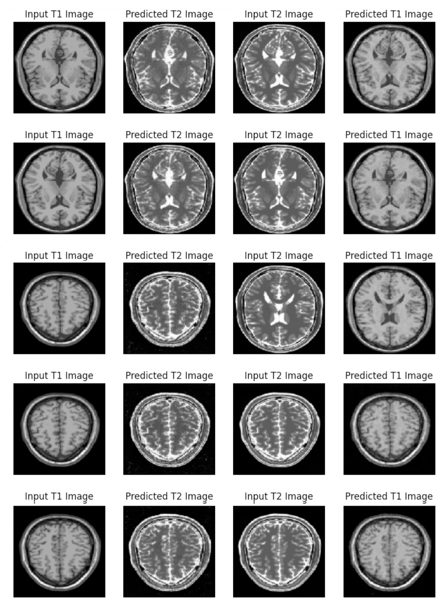

# Style-Transfer-using-GAN
A Capstone Project to build a Generative adversarial model(modified U-Net) which can generate artificial MRI images of different contrast levels from existing MRI scans.

## Table of Contents
* [General Info](#general-information)
* [Project Contents](#project-contents)
* [Conclusion](#conclusion)
* [Software and Library Versions](#software-and-library-versions)
* [Acknowledgements](#acknowledgements)

### General Information
Misdiagnosis in the medical field is a very serious issue but it’s also uncomfortably common to occur. Imaging procedures in the medical field requires an expert radiologist’s opinion since interpreting them is not a simple binary process ( Normal or Abnormal). Even so, one radiologist may see something that another does not. This can lead to conflicting reports and make it difficult to effectively recommend treatment options to the patient.

One of the complicated tasks in medical imaging is to diagnose MRI(Magnetic Resonance Imaging). Sometimes to interpret the scan, the radiologist needs different variations of the imaging which can drastically enhance the accuracy of diagnosis by providing practitioners with a more comprehensive understanding.

But to have access to different imaging is difficult and expensive. With the help of deep learning, we can use style transfer to generate artificial MRI images of different contrast levels from existing MRI scans. This will help to provide a better diagnosis with the help of an additional image.

#### Data Set Brief Information
A RAR file - **MRI+T1_T2+Dataset.RAR** is provided as dataset. The file contains two basic types of MRI images - T1-weighted and T2-weighted images, often referred to as T1 and T2 images.
* The timing of radiofrequency pulse sequences used to make T1 images results in images which highlight fat tissue within the body.
* The timing of radiofrequency pulse sequences used to make T2 images results in images which highlight fat AND water within the body.

The T1 and T2 MRI Images included in the dataset are not related in any way since it is an unpaired dataset.

#### Business Objective
In this Capstone project, CycleGAN is used to translate the style of one MRI image to another, which will help in a better understanding of the scanned image. Using GANs you will create T2 weighted images from T1 weighted MRI image and vice-versa.

#### Business Solution
Generated artificial MRI images of different contrast levels from existing MRI scans can drastically enhance the accuracy of diagnosis and in turn effectively recommend treatment options to the patient.

### Project Contents
* **Style Transfer using GAN.ipynb** - Jupyter Notebook for Capstone - Style Transfer using GAN (Language : Python)
* **cyclegan-mri.gif** - A Gif file of CycleGAN predicted output per Epoch
* **predicted.jpg** - JPEG image of translated images
* **model.png** - PNG image of model designed for Discriminator
* **README.md** - Readme file

### Conclusion
CycleGAN was trained to translate T1 and T2 image to T2 and T1 image respectively. The model was trained for **250 epochs** using U-net architecture.

#### Training Progress per Epoch

#### Predicted Images

#### Recommendation
Model successfully generates authentic MRI image from given input image.
* Generator G Loss : **2.93**
* Generator F Loss : **2.27**
* Discriminator X Loss : **0.54**
* Discriminator Y Loss : **0.30**

### Software and Library Versions
* 

* 

* 

* 

* 

* 

* 

* 

* 

* 

* 

### Acknowledgements
This CycleGAN based model Capstone Project was done as part of [Upgrad](https://www.upgrad.com/ ) - **Master of Science in Machine Learning & Artificial Intelligence** programme.

### Contact
Created by [Sanjeev Surendran](https://github.com/Sanjeev-Surendran)

<!-- ## License -->
<!-- This project is not a open source and sharing the project files is prohibited. -->
